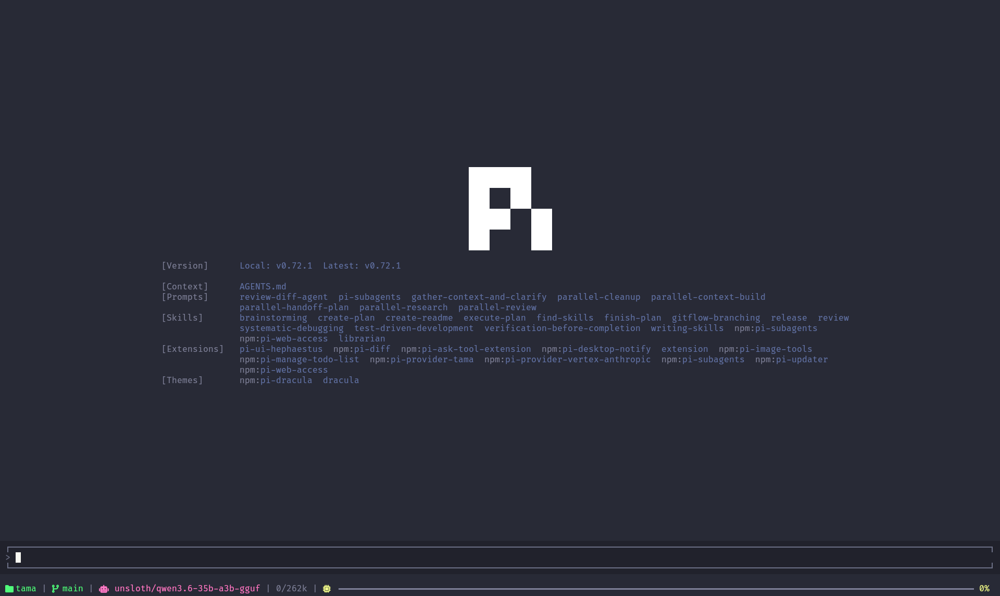

<div align="center">
  

  # Hephaestus
  *Visual polish and useful context for the Pi coding agent TUI*

  [](https://www.npmjs.com/package/pi-ui-hephaestus)
  [](https://www.typescriptlang.org)
  [](LICENSE)

</div>

Hephaestus transforms the Pi coding agent terminal into a polished, information-rich workspace. It adds an animated splash screen, a framed editor with a double-press quit guard, muted thinking blocks, per-message response times, syntax-highlighted diff rendering for file writes and edits, and a compact footer that surfaces your git status, model, and context window usage at a glance.

## What's inside

### Animated splash screen

A smooth reveal animation greets you on startup — the Pi logo fades in diagonally, followed by version info, loaded context, prompts, skills, extensions, and themes. It gives the TUI a proper launch feel instead of an abrupt prompt.

### Framed editor pane

The input area gets a clean bordered frame with a `▁` top edge and `▔` bottom edge, visually separating it from the chat history. There's also a **double-press quit guard**: pressing the clear key once shows a brief "press again to quit" hint, preventing accidental exits while you're mid-conversation.

### Muted thinking blocks

Thinking (reasoning) content is rendered in muted colors so it doesn't compete with the actual response. Code blocks inside thinking sections are automatically unindented for readability. The label text and color are fully customizable through settings.

### Response time per message

Each user message gets a right-aligned timer showing how long the AI took to respond — displayed as `12.3s` or `2m 14s` depending on duration. This makes it easy to spot which prompts trigger long reasoning cycles.

### Rich single-line footer

A compact status bar at the bottom packs useful information without stealing vertical space:

- **Directory** and **git branch** with clean/dirty indicator
- **Active model** name
- **Thinking level** indicator (when the agent is reasoning)
- **Worktree branch** (if you're using one)
- **Token usage** — input/output/cache counts and cost estimate
- **Context window bar** — a progress bar showing how much of the context window is used, with color-coded warnings at 80% and 95%

### Syntax-highlighted diff rendering

When the agent writes or edits files, Hephaestus renders a **Shiki-powered, syntax-highlighted diff** instead of plain text output. This makes it easy to see exactly what changed at a glance.

- **Split view** (side-by-side) for `edit` tool — old on left, new on right, with diagonal stripes filling empty slots
- **Unified view** (stacked) for `write` tool overwrites — single column with `+`/`-` gutter
- **Word-level emphasis** — brighter backgrounds on changed characters so you see exactly what changed
- **Auto-derives colors** from your Pi theme — diffs look good with any terminal background, no configuration needed
- **Adaptive layout** — auto-detects terminal width; wraps on wide terminals, truncates on narrow ones
- **Graceful degradation** — if Shiki fails to load, diffs still render as plain text with diff structure

## Installation

```bash
npm install -g pi-ui-hephaestus
```

The extension loads automatically when Pi detects it in your global npm packages. No configuration needed to get started.

## Settings

Run the `/hephaestus` slash command to open the interactive settings panel:

| Setting | Description | Default |
|---|---|---|
| **Muted Theme** | Use subdued colors for thinking blocks | Off |
| **Code Unindent** | Remove 2-space indent from code blocks inside thinking sections | On |
| **Label Text** | Custom prefix shown before thinking blocks | `Thinking...` |
| **Label Color** | RGB color for the thinking label | `255,215,0` |
| **Diff Theme** | Shiki syntax-highlighting theme for diffs | `github-dark` |
| **Split Min Width** | Min terminal columns for split view (≥ 100) | `150` |
| **Split Min Code Width** | Min code columns per side in split (≥ 30) | `60` |

Navigate with arrow keys, press Enter to toggle or open submenus, and use the **Save** button at the bottom to persist changes. Press **ESC** to cancel without saving.

## Configuration

Settings are stored in `~/.pi/agent/settings.json` under the `"hephaestus"` key:

```json
{
  "hephaestus": {
    "mutedTheme": false,
    "codeUnindent": true,
    "labelText": "Thinking...",
    "labelColor": "255,215,0",
    "diffTheme": "github-dark",
    "diffSplitMinWidth": 150,
    "diffSplitMinCodeWidth": 60
  }
}
```

You can also edit this file directly to fine-tune values.

## Requirements

- Pi TUI with extension support (`@mariozechner/pi-coding-agent` >= 0.1.0)
- Node.js >= 24
